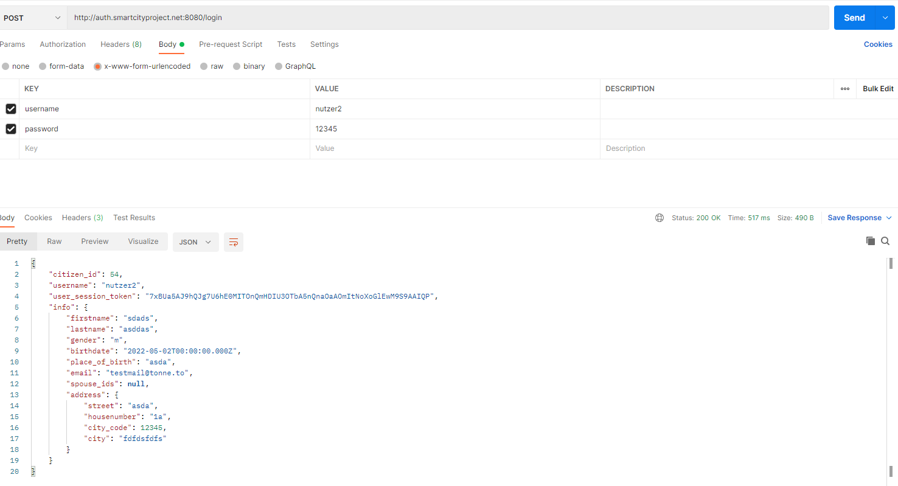

# Endpunkte

## POST /verify

### Parameter
- Typ: www-form-urlencoded
- code : Ein Alphanumerischer Session-Token, bestehend aus 64 Zeichen 

 ### Antwort
Falls der Session-Token gültig ist, wird die individuelle Bürger-ID, der Nutzername und Infos über den registrierten Bürger zurückgegeben (JSON)

Falls der Token ungültig oder abgelaufen ist, wird 404 Not Found zurückgegeben.
In diesem Fall sollte der /login oder /external Endpunkt verwendet werden, um die Identität des Nutzers abzufragen

### Infos
In Zukunft werde ich vermutlich hilfreichere Fehlermeldungen zurückgeben

---

## POST /login
- Typ: www-form-urlencoded
- username: Benutzername eines Nutzers
- password: Passwort eines Nutzers

### Antwort
Falls Nutzername und Passwort gültig sind und einem registrierten Nutzer zugeordnet werden können,
wird (falls nötig) eine neue Session für den Nutzer erstellt und zurückgegeben.
Falls eine Session bereits existiert, wird diese zurückgegeben aber nicht verlängert. Es wird kein Cookie gesetzt.

Gibt zusätzlich Infos über den Nutzer zurück

## GET /external
## Parameter
redirect_success: URL zu der der Nutzer nach erforlgreicher Anmeldung weitergeleitet wird

redirect_error: URL zu der der Nutzer nach unerfolgreicher Anmeldung weitergeleitet wird

## Beschreibung
Verwendet intern /login.
Leitet den Nutzer an eine Login Seite weiter. Gibt der Nutzer auf der Loginseite passende Daten an, wird der Nutzer an die redirect_success URL weitergeleitet. Der Token wird als Parameter an die redirect_success URL angehängt und als Cookie unter "user_session_token" gespeichert.

Beispiel: 
GET 

http://auth.smartcityproject.net:8080/external?redirect_success=https://www.google.com/&redirect_error=blub 

Wenn sich der Nutzer erfolgreich anmeldet, wird ein GET Request an 

https://www.google.com/?token=xyz gesendet.

Um Informationen über den angemeldeten Nutzer zu bekommen, kann der erhaltene Token an den /verify Endpunkt gesendet werden

## Employee
Die Endpunkte /employee/verify, employee/login und employee/external funktionieren größtenteils genauso wie die User Endpunkte. In Anworten und Cookies wird statt einem "user_session_token" ein "employee_session_token" zurückgegeben.
Mitarbeiter sind nur Nutzer ohne Bürgeridentität. Bestehende Mitarbeiter können mit dem /employee/register Endpunkt neue Angestellte erstellen

## POST /employee/register
### Parameter
code: Ein "employee_session_token" eines bestehenden Mitarbeiters. Aus Testzwecken reicht auch "ROOT"
firstname: Vorname des neuen Mitarbeiters
lastname: Nachname des neuen Mitarbeiters
username: Nutzername des neuen Mitarbeiters
password: Passwort des neuen Mitarbeiters

### Antwort
200: Erfolg
404: Session ist ungültig
500: Angesteller extistiert bereits
